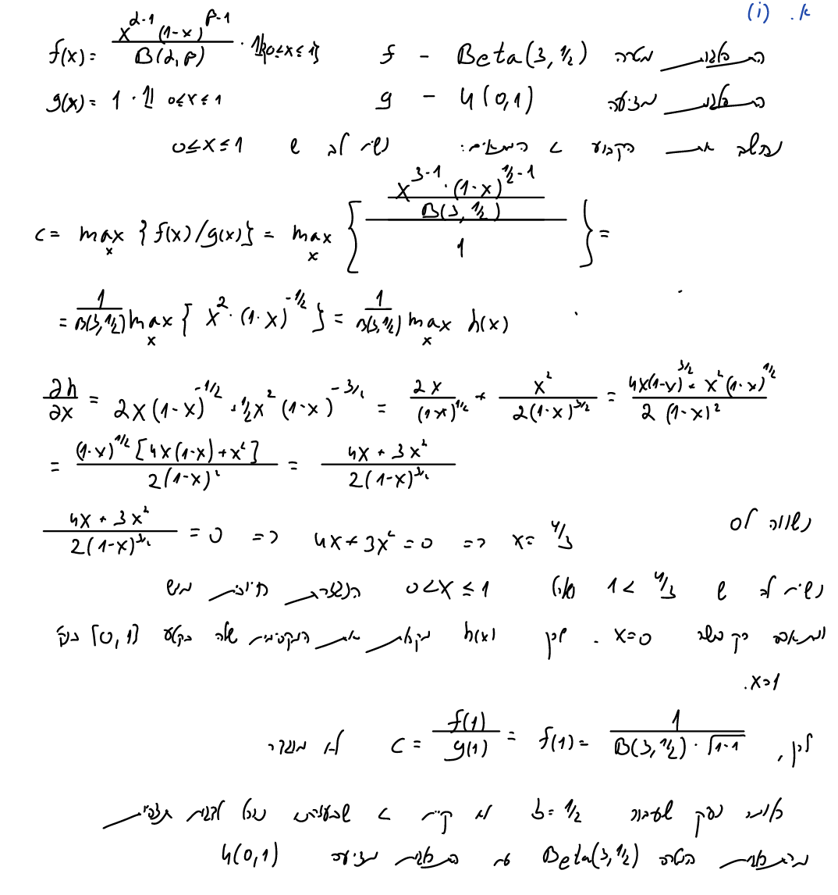
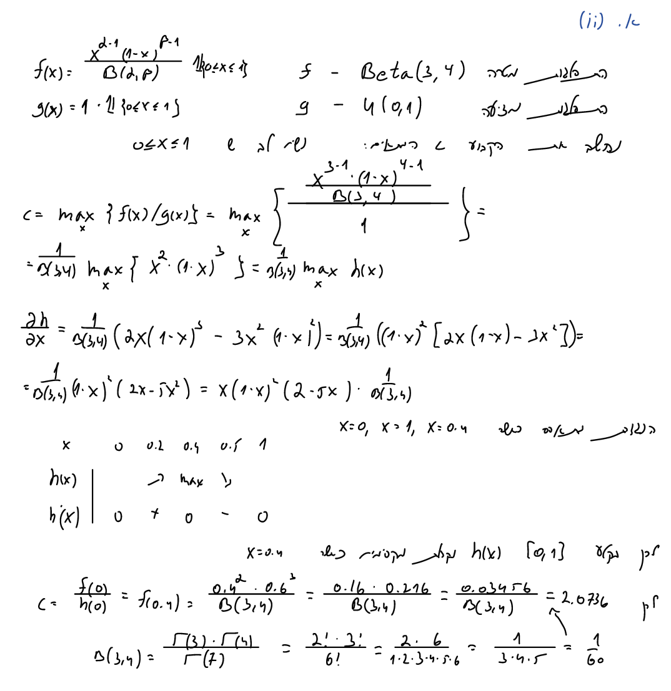
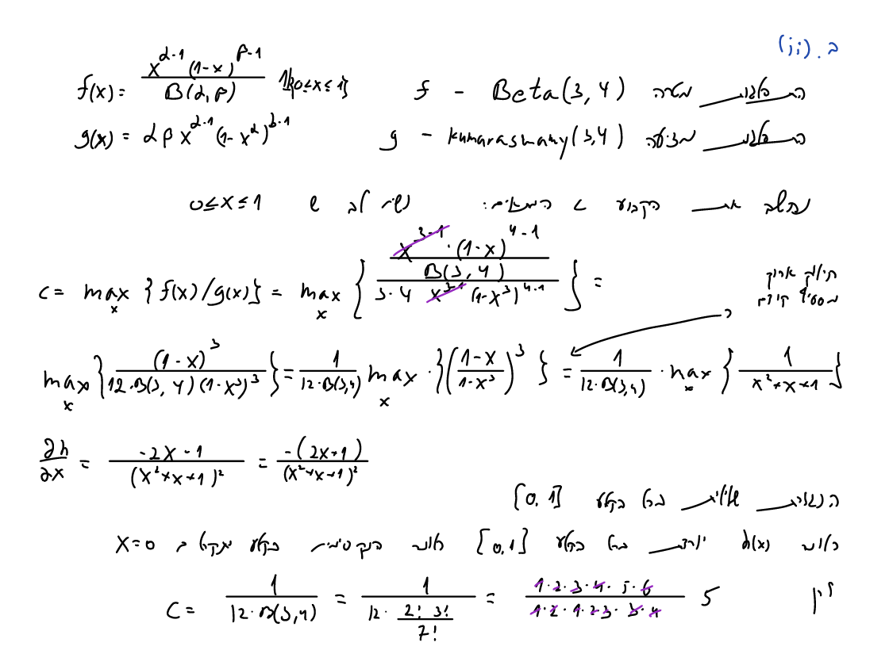

# Q1 #

## a ##

### a.1 ###

```{r}

```

### a.2 ###

```{r}

```

## b ##

### b.1 ###

```{r}
knitr::include_graphics(c("1.b.1.1.png","1.b.1.2.png"))
```

### b.2 ###

```{r}

```

## c ##

### Sample from Kumaraswamy(alpha,beta) Inverse Function Method ###

```{r}
func_kumaraswamy <- function(alpha,beta){
  inverse_func <- function(u,alpha,beta){
    (1-(1-u)^(1/beta))^(1/alpha)
    } # Lets compute the inverse function: F(x)=u, u~U(0,1).
  u <- runif(n = 1,min = 0,max = 1)
  y <- inverse_func(u,alpha,beta) # For any u in U we compute the x value.
  y
  }
```

### Samples from Beta Distribution Accept-Reject Method ###

```{r}
func_1.c <- function(alpha,beta,c){
  x <- vector()
  while(length(x)<10000){
    u <- runif(n = 1,min = 0,max = 1) # we take one sample from U(0,1)
    y <- func_kumaraswamy(alpha = alpha,beta = beta) # we take one sample from kumaraswamy(alpha,beta) like previous exercie
    a <- pbeta(y,alpha,beta)
    b <- alpha*beta*y^(alpha-1)*(1-y^alpha)^(beta-1)
    if ((a/c*b)>=u){
      x <- c(x,y)
    }
  }
  hist(x,50)
  summary(x)
}
```

### c.1 - beta = 0.5 ###

```{r}
func_1.c(alpha = 3,beta = 0.5, c = (15*sqrt(3))/(1.5*16))
```

### c.2 - beta = 4 ###

```{r}
func_1.c(alpha = 3,beta = 4, c = 5)
```

# Q2 #

## Cauchy Distibution ##

```{r}
knitr::include_graphics(c("2.1.1.png","2.1.2.png","2.1.3.png"))
```

## Double Exponential Distibution ##

```{r}
knitr::include_graphics(c("2.2.1.png","2.2.2.png","2.2.3.png"))
```


